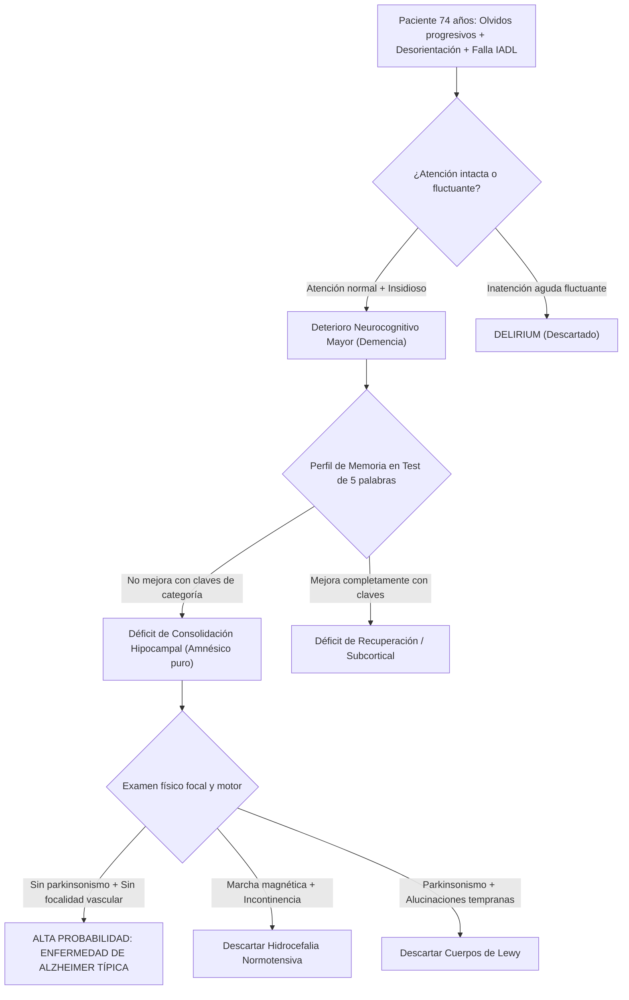

# 🧠 CASO CLÍNICO SOCRÁTICO INTERACTIVO
## CÁTEDRA DE NEUROLOGÍA CLÍNICA — SEMANA 12 (SÍNDROMES DEMENCIALES)
**Hospital de Especialidades Carlos Andrade Marín (HCAM) | Aula de Administración**  
*Docente: Dr. Alcy Torres | Semestre 2026-2*  
*Tema:* Síndromes demenciales, Enfermedad de Alzheimer y deterioro neurocognitivo  
*Marco Metodológico:* `KNOW -> REASON -> ACT`

---

### 📋 VIÑETA CLÍNICA DE ENTRADA

> **Paciente:** Femenina de 74 años, profesora de primaria jubilada, diestra, con 16 años de escolaridad.  
> **Acompañante:** Su hija mayor (abogada), quien convive con ella y es la informante colateral.  
> **Motivo de consulta:** "Mi mamá repite las mismas preguntas, se perdió volviendo del mercado y dice que no le pasa nada."

#### ⏱️ Cronología y Enfermedad Actual:
- **Evolución:** Cuadro de **18 meses de evolución**, de inicio lento e insidioso. Comenzó olvidando compromisos familiares, citas médicas y dónde guardaba objetos cotidianos (llaves, cédula, dinero).
- **Repetición y Anosognosia:** Repite la misma pregunta varias veces en el lapso de una hora olvidando que ya le respondieron. La paciente minimiza el problema, asegurando que «son cosas normales de la edad» (*anosognosia*).
- **Episodio de desorientación espacial:** Hace 3 semanas salió a comprar a tres cuadras de su casa y fue encontrada desorientada y angustiada por un vecino a 10 cuadras de distancia, incapaz de orientar el rumbo a su hogar.
- **Actividades de la Vida Diaria (IADL):**
  - Ha quemado dos ollas en la cocina al olvidar apagarlas.
  - Ha cometido errores en el manejo del dinero y en el pago de servicios básicos (la hija tuvo que asumir las cuentas bancarias).
  - La paciente conserva el aseo personal, la vestimenta y la continencia de esfínteres (actividades básicas preservadas).
- **Antecedentes:** Hipertensión arterial en tratamiento con Losartán 50 mg/día. Sin antecedentes de traumatismo ni síntomas depresivos mayores previos.

---

### 🩺 EXAMEN FÍSICO Y COGNITIVO DIRIGIDO

| Segmento / Dominio | Hallazgo Clínico Semiótico |
| :--- | :--- |
| **Nivel de Conciencia y Atención:** | Alerta, cooperadora, socialmente afable. Prueba de inversión de meses (diciembre a enero): realizada sin errores. **Atención preservada** (descarta delirium en este momento). |
| **Orientación:** | Orientada en persona. Desorientada en tiempo (falla día del mes y año por 2 años) y parcialmente desorientada en espacio (conoce la ciudad y hospital, no el piso ni el consultorio). |
| **Memoria Episódica Anterógrada:** | **Test de 5 palabras:** Registro inmediato 5/5. Recuerdo libre a los 5 minutos: **0/5**. Recuerdo facilitado con clave de categoría semántica: **1/5** (solo evocó la flor). Reconocimiento con opciones múltiples: **1/5**, con frecuentes falsos reconocimientos (*intrusiones*). **Fallo franco de consolidación hipocampal**. |
| **Lenguaje:** | Fluente, gramaticalmente correcto, pero con pausas por anomia (dificultad para encontrar palabras precisas) y circunloquios («eso para ver la hora» por reloj). Comprensión y repetición normales. |
| **Funciones Ejecutivas y Visoespaciales:** | **Test del Dibujo del Reloj:** Esfera circular adecuada, pero coloca todos los números en el hemicampo derecho (déficit de planificación/heminegligencia atencional sutil) y las manecillas marcan el 11 y el 10 en lugar de las 11:10 (atrapamiento por el estímulo). |
| **Puntaje Global:** | **MoCA (Montreal Cognitive Assessment): 19/30** (Pérdida de puntos en memoria diferida 0/5, orientación 3/6, abstracción 1/2, reloj 1/3). |
| **Examen Neurológico Focal:** | Pares craneales normales. Fuerza 5/5 simétrica. Reflejos osteotendinosos 2/4 simétricos. Respuesta plantar flexora bilateral. **Sin signos extrapiramidales (no hay rigidez, temblor ni bradicinesia)**. Marcha libre, estable, sin base ancha ni festinación. |

---

## 💡 GUÍA DE DEBATE SOCRÁTICO (4 ETAPAS PARA EL AULA)

---

### ❓ ETAPA 1: DELIMITACIÓN SÍNDROMICA Y FUNCIONAL
- **Pregunta Socrática 1:** *«¿Por qué la pérdida de autonomía en el manejo de las finanzas y la cocina clasifica a esta paciente como un Deterioro Neurocognitivo Mayor (Demencia) y no como un Deterioro Cognitivo Leve (MCI) o Queja Subjetiva?»*
- **Clave Docente:** El criterio divisorio fundamental entre Deterioro Cognitivo Leve y Mayor según DSM-5 es la **preservación o pérdida de la independencia en las Actividades Instrumentales de la Vida Diaria (IADL)**. Al requerir que un tercero asuma el manejo financiero y la cocina por riesgo vital, cruza el umbral de demencia.

---

### ❓ ETAPA 2: LA SEMIOLOGÍA DEL RECUERDO CON CLAVES (*CUED RECALL*)
- **Pregunta Socrática 2:** *«Durante el test de recuerdo diferido, la paciente obtuvo 0/5 espontáneo y apenas 1/5 con claves de categoría semántica, presentando además intrusiones. ¿Qué estructura neuroanatómica está disfuncional y por qué este hallazgo descarta un simple olvido por envejecimiento o depresión?»*
- **Clave Docente:** 
  - Si el problema fuera de recuperación frontal o inatención depresiva (pseudodemencia), la pista o clave semántica rescata la información almacenada en el hipocampo (recuerdo facilitado alto).
  - La **falta de beneficio con claves semánticas** demuestra que la información nunca se consolidó en la corteza entorrinal y los circuitos hipocampales (área CA1 y giro dentado). Es el sello de la amnesia episódica hipocampal de la Enfermedad de Alzheimer.

---

### ❓ ETAPA 3: DIAGNÓSTICO DIFERENCIAL A LA CABECERA
- **Pregunta Socrática 3:** *«Si la hija mencionara que la paciente ve personas desconocidas sentadas en el comedor que no le dan miedo, y además nota que camina más rígida y arrastrando los pies, ¿hacia qué entidad viraría inmediatamente nuestra hipótesis diagnóstica y qué fármacos estarían formalmente contraindicados?»*
- **Clave Docente:**
  - Viraría hacia **Demencia por Cuerpos de Lewy (DCL)**.
  - Los **antipsicóticos típicos (Haloperidol)** y neurolépticos bloqueadores D2 están formalmente contraindicados por el riesgo de reacción de hipersensibilidad neuroléptica grave (parkinsonismo irreversible, rigidez extrema, coma y letalidad).

---

### ❓ ETAPA 4: PLAN DE ACCIÓN RACIONAL (`ACT`)
- **Pregunta Socrática 4:** *«Antes de prescribir un inhibidor de acetilcolinesterasa (Donepezilo) o solicitar biomarcadores avanzados en LCR, ¿cuál es el plan paraclínico mínimo e innegociable en el HCAM?»*
- **Clave Docente:**
  1. **Laboratorio de causas reversibles:** TSH, Vitamina B12, Ácido Fólico, VDRL/Treponémico, electrolitos, pruebas hepáticas y renales.
  2. **Neuroimagen estructural (RM cerebral protocolo demencia):** Secuencias T1 volumétrico (evaluar atrofia hipocampal con escala Scheltens), T2/FLAIR (evaluar carga isquémica microvascular Fazekas) y T2* gradiente/SWI (descartar microsangrados amiloides o hematoma subdural crónico).
  3. **Medidas no farmacológicas de seguridad inmediata:** Retirar hornallas de gas o usar cocina de inducción con apagado automático, supervisión de medicamentos, identificación personal con GPS o pulsera ante riesgo de desorientación en la vía pública.

---
*MedSemiotics Copilot — Cátedra de Neurología Clínica y Semiótica — UCE / HCAM*
