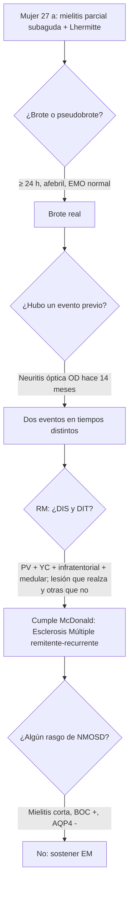

# 🧠 CASO CLÍNICO SOCRÁTICO INTERACTIVO
## CÁTEDRA DE NEUROLOGÍA CLÍNICA — SEMANA 14 (ENFERMEDADES DESMIELINIZANTES)
**Hospital de Especialidades Carlos Andrade Marín (HCAM) | Aula de Administración**  
*Docente: Dr. Alcy Torres | Semestre 2026-2*  
*Tema:* Enfermedades desmielinizantes del SNC (Esclerosis Múltiple y NMO)  
*Marco Metodológico:* `KNOW -> REASON -> ACT`

> Caso **100 % sintético**, construido con fines docentes. No corresponde a ningún paciente real.

---

### 📋 VIÑETA CLÍNICA DE ENTRADA

> **Paciente:** Femenina de 27 años, diseñadora gráfica, diestra, sin comorbilidades.  
> **Motivo de consulta:** "Desde hace cinco días siento las piernas dormidas desde el ombligo hacia abajo y, cuando agacho la cabeza, me baja como una corriente por la espalda."

#### ⏱️ Cronología y Enfermedad Actual:
- **Evento actual:** Parestesias ascendentes en ambos miembros inferiores que se instalaron en 48 horas y se mantienen estables desde hace tres días. Refiere urgencia miccional. Sin fiebre, sin síntomas urinarios irritativos, sin cuadro infeccioso previo.
- **Signo referido:** Sensación eléctrica que recorre la columna hacia las piernas al flexionar el cuello.
- **Antecedente clave (interrogatorio dirigido):** Hace **14 meses** tuvo visión borrosa del **ojo derecho** con **dolor al mover el ojo**, durante unas tres semanas. Un oftalmólogo le dijo que el fondo de ojo era normal; mejoró sin tratamiento y no se realizaron estudios.
- **Otros:** Fatiga vespertina desde hace un año. Al ducharse con agua muy caliente nota que la visión del ojo derecho «se empaña» por unos minutos.

---

### 🩺 EXAMEN FÍSICO Y NEUROLÓGICO DIRIGIDO

| Segmento / Dominio | Hallazgo Clínico Semiótico |
| :--- | :--- |
| **Signos vitales:** | T 36,6 °C, PA 112/70 mmHg, FC 74 lpm. Afebril. |
| **Vía visual:** | AV OD 20/30, OI 20/20. **Desaturación del rojo en OD.** Prueba de la linterna oscilante: **defecto pupilar aferente relativo derecho**. Fondo de ojo: **palidez temporal del disco óptico derecho**. |
| **Motilidad ocular:** | En la mirada hacia la izquierda, el ojo derecho no completa la aducción y el ojo izquierdo presenta nistagmo en abducción. Convergencia conservada. |
| **Motor:** | Fuerza 5/5 en miembros superiores; 4+/5 en flexores de cadera bilaterales. |
| **Reflejos:** | Miembros superiores 2/4; **rotulianos y aquíleos 3/4**; **Babinski bilateral**. |
| **Sensibilidad:** | Hipoestesia táctil y dolorosa con **nivel sensitivo T10 incompleto**, más marcada a la izquierda. Vibración disminuida en maléolos. **Signo de Lhermitte presente.** |
| **Coordinación y marcha:** | Marcha en tándem insegura. Romberg negativo. |

#### 🧪 Estudios (se revelan por etapas, no al inicio):
- **EMO y hemograma:** normales.
- **RM cerebral con gadolinio:** 6 lesiones T2 ovoides; 3 **periventriculares perpendiculares al cuerpo calloso**, 1 **yuxtacortical** frontal, 1 en el **pedúnculo cerebeloso medio** derecho. Ninguna realza.
- **RM de médula:** lesión T2 **periférica, posterolateral en T8-T9, de un segmento vertebral**, **que realza** con gadolinio.
- **LCR:** 6 células/mm³ (linfocitos), proteínas 42 mg/dL, **bandas oligoclonales tipo 2 (restringidas al LCR)**.
- **AQP4-IgG y MOG-IgG (base celular):** negativos.

---

## 💡 GUÍA DE DEBATE SOCRÁTICO (4 ETAPAS PARA EL AULA)

### 🟢 Etapa 1 — KNOW: ¿Qué es exactamente lo que le pasa hoy?
1. **¿Cumple este evento la definición operativa de brote?** Justifique con tres datos del caso.
   - *Clave docente:* dura más de 24 horas, se instaló en días, la paciente está afebril y el EMO es normal.
2. **¿Dónde está la lesión?** Integre el nivel sensitivo, la hiperreflexia con Babinski bilateral y el signo de Lhermitte.
   - *Clave docente:* mielopatía torácica **parcial** (compromiso de cordones posteriores y laterales). El signo de Lhermitte indica compromiso de los cordones posteriores cervicales.
3. **¿Qué significa el calor que «empaña» la visión?**
   - *Clave docente:* **fenómeno de Uhthoff**: bloqueo de conducción transitorio en un nervio óptico previamente desmielinizado. **No es un brote.**

### 🟡 Etapa 2 — REASON: ¿Es el primer evento?
4. **¿Qué hallazgo del examen demuestra que el episodio visual de hace 14 meses fue real y dejó secuela?**
   - *Clave docente:* **defecto pupilar aferente relativo derecho** con palidez temporal del disco. El examen convierte un antecedente contado por la paciente en evidencia objetiva.
5. **¿Qué es el hallazgo de la motilidad ocular y por qué importa?**
   - *Clave docente:* **oftalmoplejía internuclear derecha**, lesión del fascículo longitudinal medial. Es una tercera localización (tronco).
6. **Con la clínica sola, ¿ya hay diseminación en espacio y en tiempo?**
   - *Clave docente:* sí, clínicamente: nervio óptico (hace 14 meses), médula y tronco (actual). La RM confirma y excluye otras causas.

### 🟠 Etapa 3 — REASON: Los estudios y el diagnóstico diferencial
7. **Aplique McDonald 2017 a la RM.** ¿Cuántas regiones típicas hay comprometidas? ¿Hay DIT en una sola imagen?
   - *Clave docente:* periventricular, yuxtacortical, infratentorial y médula = 4/4 (DIS). Coexisten una lesión que realza (médula) y otras que no (DIT).
8. **¿Qué aportan las bandas oligoclonales si la RM ya cumple criterios?**
   - *Clave docente:* respaldan la síntesis intratecal de inmunoglobulinas y hacen improbable una NMOSD; en otro paciente pueden sustituir la DIT.
9. **Imagine que la RM medular mostrara una lesión central de T3 a T9 y la neuritis previa hubiera sido bilateral con visión residual de 20/200. ¿Qué cambia?**
   - *Clave docente:* mielitis **longitudinalmente extensa** + neuritis grave → sospecha de **NMOSD**. Solicitar AQP4-IgG y **no iniciar** fármacos de EM que pueden empeorarla.

### 🔴 Etapa 4 — ACT: ¿Qué hacemos mañana en la guardia?
10. **¿Trataría este brote?** ¿Con qué objetivo?
    - *Clave docente:* el brote es sintomático y compromete la marcha y la micción: metilprednisolona IV en pulsos (referencia: 1 g/día, 3–5 días) según protocolo institucional. Acelera la recuperación; no cambia el pronóstico a largo plazo.
11. **¿Qué le explica a la paciente sobre una futura «recaída» con fiebre?**
    - *Clave docente:* si los síntomas antiguos reaparecen con fiebre o calor, primero se busca la infección (pseudobrote); un brote verdadero requiere un déficit nuevo que dure más de 24 horas.
12. **¿Qué sigue después del alta?**
    - *Clave docente:* referencia a Neurología para iniciar terapia modificadora de la enfermedad, EDSS basal, vacunas y tamizaje previos al tratamiento.

---

### 🎫 TICKET DE SALIDA (3 PREGUNTAS, RESPUESTA INDIVIDUAL)
1. Escriba la definición operativa de brote en una línea.
2. Nombre dos hallazgos que lo harían sospechar NMOSD antes que EM.
3. ¿Cómo explora el defecto pupilar aferente relativo y qué observa si está presente?

---
*MedSemiotics Copilot — Cátedra de Neurología Clínica y Semiótica — UCE / HCAM*
