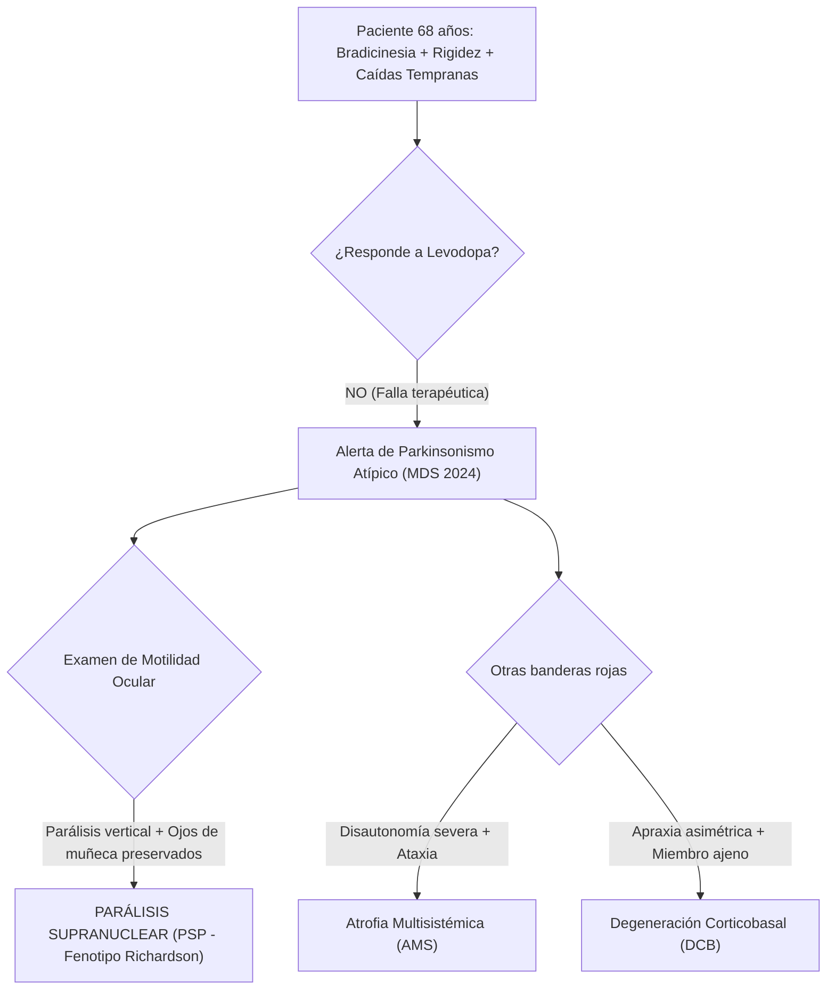

# 🧠 CASO CLÍNICO SOCRÁTICO INTERACTIVO
## CÁTEDRA DE NEUROLOGÍA CLÍNICA — SEMANA 11 (TRASTORNOS DEL MOVIMIENTO II)
**Hospital de Especialidades Carlos Andrade Marín (HCAM) | Aula de Administración**
*Docente: Dr. Alcy Torres | Semestre 2026-2*

---

### 📋 VIÑETA CLÍNICA DE ENTRADA

> **Paciente:** Masculino de 68 años, jubilado (exconductor de transporte pesado), diestro.  
> **Acompañante:** Su cónyuge, quien es la principal informante.  
> **Motivo de consulta:** "Se cae hacia atrás a cada rato, está muy lento y tiene la mirada perdida."

#### ⏱️ Cronología y Enfermedad Actual:
- **Evolución:** Cuadro de **9 meses de evolución** caracterizado por torpeza motora generalizada, lentitud para vestirse y dificultad para incorporarse de la silla.
- **Caídas tempranas:** En los últimos 4 meses ha sufrido **6 caídas inexplicables hacia atrás (retropulsión)**, dos de ellas con traumatismo craneoencefálico leve.
- **Cambios de conducta:** La esposa nota apatía, lentitud para contestar y episodios de risa o llanto inmotivado (afecto pseudobulbar).
- **Tratamiento previo extrainstitucional:** Recibe **Levodopa/Carbidopa 250/25 mg cada 8 horas** desde hace 3 meses sin mejoría evidente en la marcha ni en la rigidez.

---

### 🩺 EXAMEN FÍSICO Y NEUROLÓGICO DIRIGIDO

| Segmento / Función | Hallazgo Clínico Semiótico |
| :--- | :--- |
| **Facies y Afecto:** | Facies hipomímica con ojos muy abiertos, parpadeo disminuido (<4/min) y expresión de asombro o perplejidad (*staring gaze*). Afecto pseudobulbar leve. |
| **Tono y Trofismo:** | **Rigidez axial marcada** (resistencia en cuello y tronco) con leve rigidez en rueda dentada simétrica en miembros superiores. No hay asimetría marcada. |
| **Temblor:** | **Ausencia** de temblor de reposo ni temblor postural significativo. |
| **Motilidad Ocular:** | **Marcada limitación para la mirada vertical voluntaria hacia abajo (parálisis de la supramirada inferior)** y hacia arriba. Movimientos sacádicos verticales lentos. Al realizar la maniobra de **ojos de muñeca (reflejo oculocefálico)**, los globos oculares se mueven en todo el rango vertical (*parálisis de origen supranuclear*). |
| **Marcha y Postura:** | Base de sustentación amplia, postura erecta con hiperextensión cervical (retrocollis). Signo del cohete positivo (*rocket sign* — se levanta de golpe y cae hacia atrás). **Prueba de retropulsión (Pull test): Grado 4 (caída franca si no se sostiene)**. |
| **Funciones Corticales:** | Mini-Mental 26/30. Marcada disfunción ejecutiva (dificultad en fluidez verbal y secuenciación motora de Luria). Sin apraxia ideomotora ni fenómeno de miembro ajeno. |

---

## 💡 GUÍA DE DEBATE SOCRÁTICO (4 ETAPAS PARA EL AULA)

---

### ❓ ETAPA 1: DISCRIMINACIÓN DE BANDERAS ROJAS
- **Pregunta Socrática 1:** *En un paciente con bradicinesia y rigidez, ¿por qué la presencia de caídas recurrentes dentro del primer año de síntomas descarta virtualmente una Enfermedad de Parkinson Idiopática (EPI)?*
- **Clave Docente:** En la EPI típica, la inestabilidad postural y las caídas aparecen de forma tardía (estadios 3-4 de Hoehn & Yahr, usualmente tras 8-10 años de evolución). Caídas en <1 año es la bandera roja #1 de PSP.

---

### ❓ ETAPA 2: LA SEMIOLOGÍA DEL REFLEJO OCULOCEFÁLICO
- **Pregunta Socrática 2:** *¿Por qué la preservación del movimiento ocular vertical durante la maniobra de ojos de muñeca demuestra que la lesión es SUPRANUCLEAR y no un daño del núcleo del III o IV par craneal?*
- **Clave Docente:** Porque los núcleos oculomotores y el fascículo longitudinal medial en el tronco encefálico están anatómicamente intactos (arco reflejo vestibular conservado); lo que está dañado es la vía descendente cortico-nuclear/mesencefálica del centro generador de sacadas verticales (núcleo intersticial rostral de Cajal).

---

### ❓ ETAPA 3: DIAGNÓSTICO DIFERENCIAL Y NEUROIMAGEN
- **Pregunta Socrática 3:** *¿Qué signo radiológico característico esperas encontrar en el corte sagital de la RMN de encéfalo para confirmar este cuadro y diferenciarlo de la Atrofia Multisistémica?*
- **Clave Docente:**
  - **En este paciente (PSP):** **Signo del Colibrí (Hummingbird sign) o Signo del Pingüino**, debido a la marcada atrofia del tegmento mesencefálico con preservación relativa de la protuberancia.
  - **En la AMS:** Se observaría el *Signo de la Cruz de Pan (Hot Cross Bun sign)* en la protuberancia o el *Signo del borde hiperintenso en el putamen*.

---

### ❓ ETAPA 4: JUICIO CLÍNICO Y PLAN HCAM
- **Diagnóstico Definitivo:** **Parálisis Supranuclear Progresiva (PSP) — Fenotipo Richardson Clásico (Criterios MDS 2024)**.
- **Conducta:**
  1. Reducción gradual de Levodopa (evitar polifarmacia inútil y efectos adversos).
  2. Terapia física y del equilibrio centrada en prevención estricta de caídas y uso de andador con peso anterior.
  3. Evaluación por fonoaudiología para videodeglución (detección precoz de disfagia silente y prevención de neumonía por aspiración).
