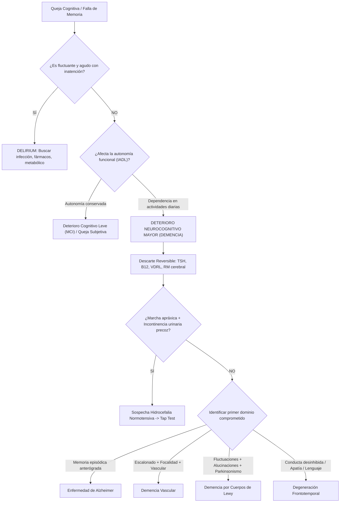

# 🧠 GUÍA CLÍNICA & INFOGRAFÍA DIAGNÓSTICA: SÍNDROMES DEMENCIALES
## ENFERMEDAD DE ALZHEIMER Y DETERIORO NEUROCOGNITIVO (DSM-5 / NIA-AA)
**Cátedra de Neurología Clínica y Semiótica Médica — Semestre 2026-2**  
*Hospital de Especialidades Carlos Andrade Marín (HCAM) | Aula de Administración*  
*Fecha de Clase: 2026-09-08 (Martes 16:00 - 17:30)*  
*Módulo Interactivo:* https://powersemiotics.com/medsemiotics/neurologia/demencias.html

---

### 📌 1. REGLA CARDINAL Y PRIMER PASO OBLIGATORIO: DESCARTE DE DELIRIUM

Antes de diagnosticar un deterioro neurocognitivo o síndrome demencial, **es imperativo descartar Delirium (Síndrome Confusional Agudo)**.

| Característica Semiótica | Delirium (Síndrome Confusional) | Síndrome Demencial (Neurodegenerativo) |
| :--- | :--- | :--- |
| **Inicio:** | Agudo / Subagudo (horas a días). | Insidioso, crónico y lentamente progresivo (meses a años). |
| **Curso temporal:** | **Fluctuante**, empeora en la noche (*sundowning*). | Progresivo o escalonado, pero estable en el curso del día. |
| **Atención:** | **Gravemente alterada** (inatento, distractil, incapaz de fijar). | Relativamente preservada en etapas tempranas. |
| **Nivel de Conciencia:** | Alterado (hiperalerta / letárgico / estuporoso). | Preservado (alerta normal) hasta etapas terminales. |
| **Causa subyacente:** | Desencadenante médico agudo (infección, fármacos, electrolitos). | Neurodegeneración primaria o enfermedad cerebrovascular. |

> **Perla Semiótica:** Si el paciente no logra invertir los meses del año o deletrear «MUNDO» al revés por inatención fluctuante, examine primero infección urinaria, neumonía o toxicidad farmacológica antes de rotularlo como Alzheimer.

---

### 📊 2. TABLA DIFERENCIAL DE SÍNDROMES DEMENCIALES POR DOMINIOS (MIND THE DOMAIN)

La etiología se sospecha identificando **cuál fue el primer dominio cognitivo comprometido**:

| Entidad Clínica | Fisiopatología Clave | Primer Dominio Afectado | Características Semióticas Cardinales | Hallazgos en Neuroimagen (RM) |
| :--- | :--- | :--- | :--- | :--- |
| **Enfermedad de Alzheimer (EA)** | Depósito de $\beta$-Amiloide extracelular y ovillos neurofibrilares de Tau intraneuronales | **Memoria episódica anterógrada** | Olvida eventos recientes; la memoria remota y el lenguaje se preservan inicialmente. Pérdida del efecto de facilitación con claves (*cued recall* defectuoso). Anosognosia precoz. | Atrofia hipocampal y del lóbulo temporal medial bilateral (Escala Scheltens). |
| **Demencia Vascular (DV)** | Enfermedad de pequeños vasos (subcortical) o infartos corticales múltiples | **Función ejecutiva y velocidad de procesamiento** | Curso **escalonado** (*stepwise*), signos neurológicos focales, labilidad emocional, marcha apráxica/magnética precoz, factores de riesgo vascular mayores. | Leucoaraiosis extensa (Fazekas 2-3), infartos lacunares estratégicos en tálamo o ganglios basales. |
| **Demencia por Cuerpos de Lewy (DCL)** | Inclusiones intracitoplasmáticas de $\alpha$-sinucleína en corteza y tronco | **Atención / Función visoespacial** | **Tríada cardinal:** 1) Fluctuaciones marcadas de alerta, 2) **Alucinaciones visuales vívidas y tempranas** (personas/animales), 3) Parkinsonismo motor espontáneo. Sueño REM conductual y extrema hipersensibilidad a neurolépticos. | Preservación relativa del hipocampo; hipometabolismo occipital en PET/SPECT. |
| **Degeneración Frontotemporal (DFT) — Variante Conductual (bvFTD)** | Taupatía o TDP-43 en lóbulos frontales y temporales anteriores | **Conducta y funciones ejecutivas** | **Desinhibición social**, apatía marcada, pérdida de empatía, conductas hiperorales/glotonería, conductas repetitivas o estereotipias. Memoria episódica conservada. | Atrofia frontal y temporal anterior asimétrica («en cuchillo»). |
| **DFT — Afasias Progresivas Primarias (APP)** | Depósito focal de Tau / TDP-43 perisilviano | **Lenguaje específico** | **Variante semántica:** anomia y pérdida del significado de palabras. **Variante no fluente:** agramatismo y apraxia del habla. | Atrofia asimétrica perisilviana o polo temporal anterior izquierdo. |

---

### 🔍 3. CAUSAS TRATABLES Y POTENCIALMENTE REVERSIBLES (WORKUP OBLIGATORIO)

Todo paciente con sospecha de deterioro neurocognitivo debe someterse a despistaje sistemático:

1. **Laboratorio Básico:**
   - **Vitamina B12 y Ácido Fólico:** Descartar déficit nutricional / neuropatía / degeneración combinada.
   - **Perfil Tiroideo (TSH / T4 libre):** Descartar hipotiroidismo descompensado.
   - **Serología Infecciosa (VDRL / FTA-ABS, VIH):** Neurosífilis y demencia asociada a VIH.
   - **Función renal, hepática y electrolitos:** Encefalopatías metabólicas crónicas.
2. **Causas Estructurales Quirúrgicas:**
   - **Hematoma subdural crónico:** Antecedente de caídas leves o trauma mínimo en adultos mayores anticoagulados.
   - **Hidrocefalia Normotensiva (HNT - Síndrome de Hakim-Adams):**
     - **Tríada mnemotécnica:** *Wacky* (demencia subcortical/lentitud), *Wobbly* (apraxia de la marcha con pies pegados al piso), *Wet* (urgencia e incontinencia urinaria).
     - **Signo radiológico:** Ventriculomegalia desproporcionada a la atrofia de surcos (Índice de Evans > 0.3) con signo de DESH (*Disproportionately Enlarged Subarachnoid Space Hydrocephalus*).
     - **Prueba diagnóstica:** Prueba de evacuación de LCR (Tap test) de 30-50 ml con mejoría cuantitativa de la marcha a las 2-24 horas.

---

### 🧪 4. EVALUACIÓN COGNITIVA ESTRUCTURADA A LA CABECERA (MINUTO A MINUTO)

* **MoCA (Montreal Cognitive Assessment):** Sensibilidad >90% para Deterioro Cognitivo Leve (DCL). Puntaje normal $\ge 26/30$. Ajustar +1 punto si escolaridad $\le 12$ años.
* **Test del Dibujo del Reloj:**
  - Pide dibujar esfera, números y marcar las «11 y 10».
  - Evalúa función visoespacial, planificación ejecutiva y abstracción.
  - Colocar las manecillas en el 11 y el 10 (en lugar del 2) denota fallo de abstracción y atrapamiento por el estímulo visual (frecuente en Alzheimer y DFT).
* **Fluidez Verbal:**
  - **Semántica (Animales en 1 minuto):** Normal >15. Muy alterada en patología temporal y variante semántica.
  - **Fonológica (Palabras con letra F/P en 1 minuto):** Normal >12. Evalúa función ejecutiva prefrontal izquierda.
* **Recuerdo de 5 Palabras (Test de Buschke/Grober):**
  - Si no recuerda espontáneamente pero recupera con clave de categoría (p. ej., «era una fruta» $\rightarrow$ «manzana»): denota fallo de recuperación/atención (típico subcortical/vascular).
  - Si ni con clave ni con opciones múltiples recuerda la palabra: denota **fallo de consolidación hipocampal** (patrón característico amnésico de Alzheimer).

---

### 📋 5. ALGORITMO DIAGNÓSTICO PARA EL INTERNO Y RESIDENTE EN HCAM

---
*MedSemiotics Copilot — Cátedra de Neurología Clínica y Semiótica — UCE / HCAM*
