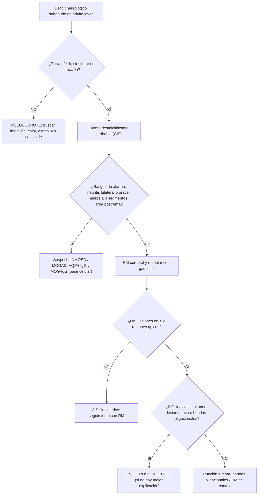

# 🧠 GUÍA CLÍNICA & INFOGRAFÍA DIAGNÓSTICA: ENFERMEDADES DESMIELINIZANTES DEL SNC
## ESCLEROSIS MÚLTIPLE, ESPECTRO DE NEUROMIELITIS ÓPTICA (NMOSD) Y MOGAD
**Cátedra de Neurología Clínica y Semiótica Médica — Semestre 2026-2**  
*Hospital de Especialidades Carlos Andrade Marín (HCAM) | Aula de Administración*  
*Fecha de Clase: 2026-09-22 (Martes 16:00 - 17:30) — Semana 14 (adelantada desde la semana 15)*  
*Módulo Interactivo:* https://powersemiotics.com/medsemiotics/neurologia/desmielinizantes.html

---

### 📌 1. REGLA CARDINAL: ¿ES UN BROTE O UN PSEUDOBROTE?

Antes de hablar de esclerosis múltiple hay que **definir operativamente el evento**. Un brote (recaída) es un déficit neurológico nuevo o el empeoramiento claro de uno previo que:

- dura **≥ 24 horas**,
- aparece **≥ 30 días** después del inicio del evento anterior,
- ocurre **sin fiebre, infección ni otra causa** que lo explique.

| Característica Semiótica | Brote Desmielinizante (Recaída Real) | Pseudobrote (Fenómeno de Uhthoff / Infección) |
| :--- | :--- | :--- |
| **Instalación:** | Subaguda: horas a días, meseta de días a semanas. | Brusca, ligada al desencadenante (calor, ejercicio, fiebre). |
| **Duración:** | ≥ 24 h, recuperación lenta en semanas. | Minutos a horas; revierte al retirar el desencadenante. |
| **Contenido:** | Déficit **nuevo** o claramente distinto. | Reaparición de síntomas **antiguos** ya conocidos. |
| **Contexto:** | Sin fiebre ni infección demostrable. | Fiebre, infección urinaria, baño caliente, esfuerzo, estrés. |
| **Conducta:** | Considerar pulsos de corticoide si es discapacitante. | **Buscar y tratar la causa** (EMO, urocultivo, hemograma). No dar corticoides. |

> **Perla Semiótica:** Ante toda «recaída» en un paciente con esclerosis múltiple, pida un examen de orina antes que una resonancia. La infección urinaria es el desencadenante más frecuente de pseudobrote.

---

### 🗺️ 2. SÍNDROMES CLÍNICOS AISLADOS (CIS): LA SEMIOLOGÍA QUE ORIENTA

| Síndrome | Semiología Típica de Esclerosis Múltiple | Rasgo Atípico (Piense en Otra Cosa) |
| :--- | :--- | :--- |
| **Neuritis óptica** | Unilateral, **dolor con los movimientos oculares**, visión borrosa central, desaturación del rojo, **defecto pupilar aferente relativo (Marcus Gunn)**, fondo de ojo normal (neuritis retrobulbar) o papilitis leve. Recuperación en semanas. | Bilateral simultánea, pérdida visual grave (≤ 20/200) sin recuperación, compromiso quiasmático, edema de papila florido → **NMOSD o MOGAD**. |
| **Mielitis** | **Parcial**, asimétrica, segmento corto (< 3 cuerpos vertebrales), nivel sensitivo incompleto, **signo de Lhermitte**. | Mielitis **transversa completa** y **longitudinalmente extensa (≥ 3 segmentos)**, compromiso central de la médula → **NMOSD**. |
| **Tronco / cerebelo** | **Oftalmoplejía internuclear (OIN)**, sobre todo **bilateral en un adulto joven**; ataxia, diplopía, neuralgia del trigémino en < 40 años. | Hipo o vómito incoercible sin causa digestiva (**síndrome del área postrema**) → **NMOSD**. |
| **Hemisferio cerebral** | Hemiparesia o hemihipoestesia subaguda; en general poca afectación cortical. | Encefalopatía, crisis y fiebre en un niño o tras infección/vacuna → **ADEM**. |

**Síntomas paroxísticos y de fatiga que también debe interrogar:** fatiga desproporcionada, fenómeno de Uhthoff, signo de Lhermitte, espasmos tónicos paroxísticos, urgencia miccional y disfunción sexual.

---

### 📊 3. TABLA DIFERENCIAL: EM vs NMOSD vs MOGAD

| Dominio | Esclerosis Múltiple (EM) | Espectro Neuromielitis Óptica (NMOSD, AQP4-IgG+) | MOGAD (anti-MOG) |
| :--- | :--- | :--- | :--- |
| **Mecanismo** | Inflamación mediada por linfocitos T y B, desmielinización multifocal y neurodegeneración. | **Astrocitopatía** autoinmune mediada por anticuerpos contra acuaporina-4 y complemento. | Oligodendrocitopatía mediada por anticuerpos contra la glicoproteína de mielina del oligodendrocito. |
| **Perfil típico** | Mujer 20–40 años. | Mujer (≈ 9:1), 30–40 años; mayor frecuencia en poblaciones afrodescendientes y asiáticas. | Niños y adultos jóvenes, sin predominio de sexo marcado. |
| **Neuritis óptica** | Unilateral, leve a moderada, buena recuperación. | Bilateral o grave, posterior/quiasmática, **recuperación pobre**. | Bilateral, anterior, **edema de papila**, realce perineural; buena recuperación. |
| **Mielitis** | Corta, periférica, parcial. | **Longitudinalmente extensa**, central, grave. | Extensa o corta, a menudo cono medular; retención urinaria. |
| **Otros síndromes** | OIN, síndromes hemisféricos. | **Área postrema**, tronco, diencéfalo (narcolepsia sintomática). | **ADEM**, encefalitis cortical con crisis. |
| **RM cerebral** | Lesiones ovoides **periventriculares perpendiculares al ventrículo (dedos de Dawson)**, yuxtacorticales, infratentoriales; signo de la vena central. | Normal o lesiones periependimarias (alrededor del III/IV ventrículo, área postrema). | Lesiones difusas, mal delimitadas, «esponjosas»; pueden desaparecer. |
| **LCR** | **Bandas oligoclonales** restringidas al LCR en la gran mayoría; pleocitosis leve. | Bandas oligoclonales generalmente **ausentes**; pleocitosis que puede superar 50 células con neutrófilos. | Bandas generalmente ausentes; pleocitosis variable. |
| **Curso** | Recurrente-remitente → secundaria progresiva; forma primaria progresiva. | Recaídas graves que acumulan discapacidad; **no hay fase progresiva**. | Monofásico o recurrente. |
| **Tratamiento** | Terapias modificadoras de la enfermedad. | Inmunosupresión específica (rituximab, eculizumab, inebilizumab, satralizumab). **Algunos fármacos de EM (interferón β, natalizumab, fingolimod) pueden empeorarla.** | Según curso; con frecuencia corticoide y, si recurre, inmunosupresión. |

> **Error con consecuencias:** Etiquetar una NMOSD como esclerosis múltiple no es un error menor de nomenclatura. Iniciar un interferón o natalizumab en una NMOSD puede precipitar recaídas graves. Ante una mielitis extensa o una neuritis óptica grave, **solicite AQP4-IgG y MOG-IgG por técnica de base celular antes de rotular**.

---

### 🔍 4. CRITERIOS DE McDONALD: DISEMINACIÓN EN ESPACIO Y TIEMPO

El diagnóstico de esclerosis múltiple exige **demostrar diseminación en espacio (DIS) y en tiempo (DIT)** y que **no exista una explicación mejor**.

**Diseminación en espacio (McDonald 2017):** ≥ 1 lesión T2 en al menos **2 de 4** regiones típicas:
1. Periventricular
2. Cortical o yuxtacortical
3. Infratentorial
4. Médula espinal

**Diseminación en tiempo:**
- Presencia simultánea de lesiones **que realzan y que no realzan** con gadolinio, **o**
- Aparición de una lesión nueva en una RM de control, **o**
- Un segundo brote clínico, **o**
- **Bandas oligoclonales específicas en LCR**, que sustituyen la DIT en un paciente con CIS típico y DIS demostrada.

> **Actualización 2024:** La revisión de los criterios de McDonald presentada en 2024 incorpora el **nervio óptico como quinta región topográfica**, reconoce biomarcadores de imagen (signo de la vena central, lesiones con anillo paramagnético) y las cadenas ligeras libres kappa en LCR. Consulte la publicación oficial para su aplicación exacta; la lógica semiótica (DIS + DIT + ausencia de mejor explicación) no cambia.

**Banderas rojas que obligan a buscar otro diagnóstico:** inicio después de los 50 años con curso progresivo desde el inicio, fiebre o síntomas sistémicos, encefalopatía, compromiso periférico (neuropatía), meningismo, LCR con más de 50 células, RM con lesiones que respetan la morfología ovoide o con realce meníngeo, y hallazgos de sarcoidosis, lupus, Behçet, déficit de B12, VIH o sífilis.

---

### 🧪 5. EXPLORACIÓN DIRIGIDA A LA CABECERA (LO QUE NO PUEDE FALTAR)

* **Vía visual:**
  - Agudeza visual con cartilla de Snellen por ojo.
  - **Desaturación del rojo:** el objeto rojo se ve «desteñido» con el ojo afectado.
  - **Prueba de la linterna oscilante:** al pasar la luz al ojo afectado, ambas pupilas se **dilatan** en lugar de contraerse → **defecto pupilar aferente relativo**.
  - Campimetría por confrontación (escotoma central o centrocecal).
  - Fondo de ojo: normal en la fase aguda retrobulbar; **palidez temporal** del disco en la fase crónica.
* **Motilidad ocular:** busque la **oftalmoplejía internuclear**: en la mirada lateral el ojo que aduce se queda corto y el que abduce presenta nistagmo; la convergencia está preservada.
* **Médula:** nivel sensitivo, sensibilidad vibratoria y posicional, reflejos, respuesta plantar, **signo de Lhermitte** (sensación eléctrica en columna y extremidades con la flexión del cuello).
* **Cerebelo:** dismetría, disdiadococinesia, nistagmo, marcha en tándem.
* **Cuantificación:** la escala **EDSS** (0 a 10) resume la discapacidad; hasta 4.0 depende sobre todo de los sistemas funcionales y, desde 4.5, de la capacidad de marcha.

---

### ⚕️ 6. MANEJO INICIAL DEL BROTE (NIVEL INTERNO / RESIDENTE)

1. **Confirmar que es un brote** y descartar pseudobrote (temperatura, EMO, hemograma, PCR).
2. **Brote discapacitante:** metilprednisolona IV 1 g/día por 3 a 5 días (o dosis oral equivalente según protocolo institucional). Acelera la recuperación; no modifica la discapacidad a largo plazo.
3. **Respuesta insuficiente o brote grave (especialmente en NMOSD):** plasmaféresis precoz.
4. **Tras el primer evento:** referir a Neurología para decidir terapia modificadora según actividad clínica y radiológica.

> Las dosis se enseñan como referencia académica. En el paciente real prevalece el protocolo institucional vigente y la decisión del especialista tratante.

---

### 📋 7. ALGORITMO DIAGNÓSTICO PARA EL INTERNO Y RESIDENTE EN HCAM

---

### 🎬 8. MATERIAL AUDIOVISUAL & MULTIMODAL COMPLEMENTARIO (CLASSROOM)

* 🎙️ **Audio Deep Dive / Podcast:** *(pendiente: agregar enlace de NotebookLM tras generarlo)*
* 🎥 **Video Clínico de Semiología:** *(pendiente: agregar enlace de YouTube)*
* 🌐 **Módulo Interactivo Web:** [PowerSemiotics — Cátedra de Neurología: Enfermedades Desmielinizantes](https://powersemiotics.com/medsemiotics/neurologia/desmielinizantes.html)
* 🧩 **Caso socrático de la clase:** `docs/caso_clinico_socratico_desmielinizantes_em.md`

### 📚 Referencias de consulta docente

- Thompson AJ, et al. Diagnosis of multiple sclerosis: 2017 revisions of the McDonald criteria. *Lancet Neurol.* 2018;17:162-173.
- Wingerchuk DM, et al. International consensus diagnostic criteria for neuromyelitis optica spectrum disorders. *Neurology.* 2015;85:177-189.
- Banwell B, et al. Diagnosis of myelin oligodendrocyte glycoprotein antibody-associated disease: International MOGAD Panel proposed criteria. *Lancet Neurol.* 2023;22:268-282.

---
*MedSemiotics Copilot — Cátedra de Neurología Clínica y Semiótica — UCE / HCAM*
